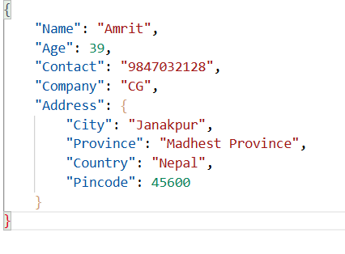
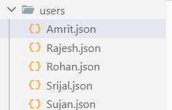

# EliteDB

EliteDB is a lightweight file-based JSON database built with Go where you can store you information like any other database software.


Check the demo video : https://youtu.be/QrhSzkpRehQ

Test the DB directly from here : https://github.com/devWisz/Elite-DB/releases/tag/1.0

ScreenShots of the project : 



## Features

- Lightweight and fast
- File-based JSON storage
- No external database required
- Human-readable records
- Thread-safe operations using mutexes
- Automatic collection creation
- Create, Read, ReadAll, and Delete support
- Safe write operations using temporary files
- Simple and clean API
- Cross-platform support
- Beginner-friendly codebase
- Open-source and customizable

---

# Installation (Manually)

## Prerequisites

Make sure the following tools are installed:

- Go 1.20 or higher
- Git

---

## Clone The Repository

```bash
git clone https://github.com/devWisz/Elite-DB.git
```

---

## Move Into The Project Directory

```bash
cd Elite-DB
```

---

## Install Dependencies

```bash
go mod tidy
```

---

# Running The Project

## Run Directly

```bash
go run main.go
```

---

## Build The Application

```bash
go build
```

---

## Run The Executable

### Windows

```bash
./Elite-DB.exe
```


#If you want to run other comments you can read all the comments mention in the code also


## Reading All Records

```go
records, err := db.ReadAll("users")
```

---

## Deleting A Specific Record

```go
db.Delete("users", "Srijal")
```

---

## Deleting An Entire Collection

```go
db.Delete("users", "")
```

# Open Source

EliteDB is fully open source.Contributions, improvements, and forks are always welcome.

Developed by devWisZ aka Sarjak Khanal.